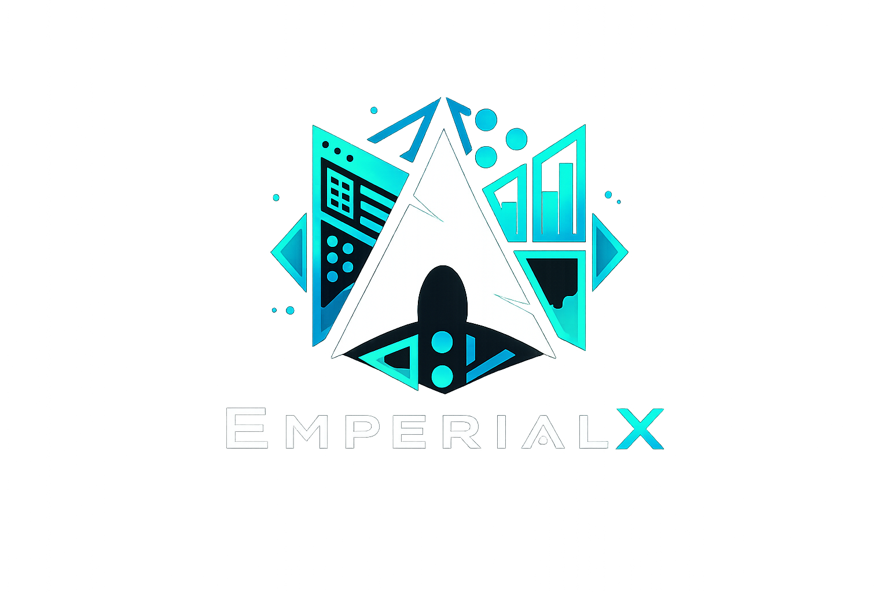
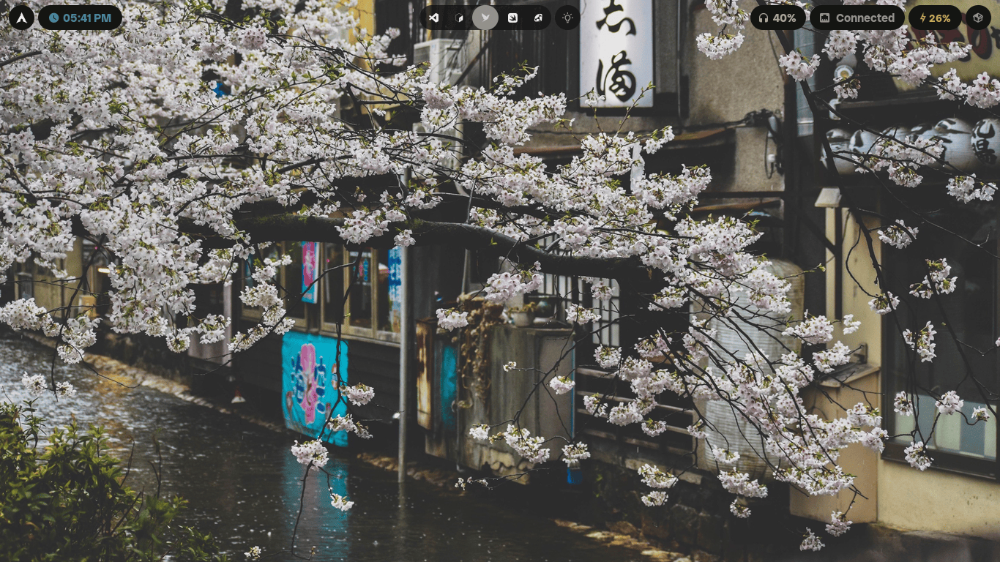
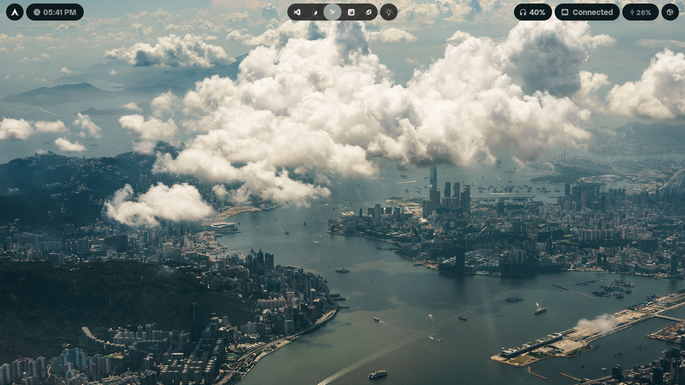
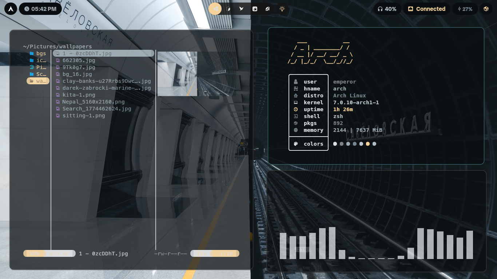
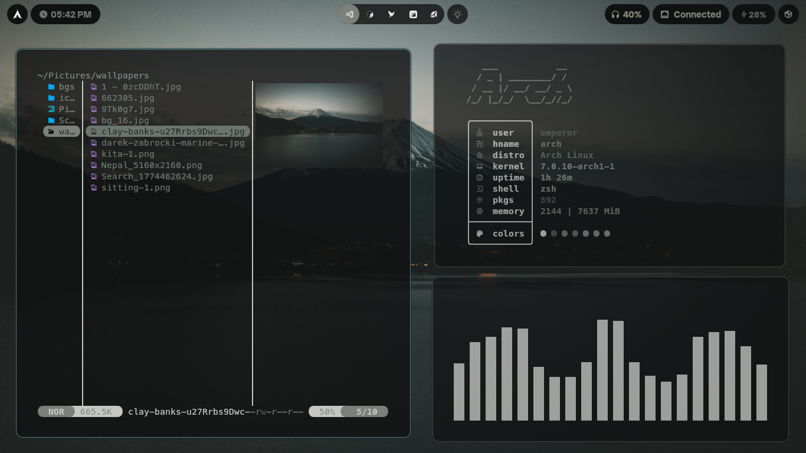
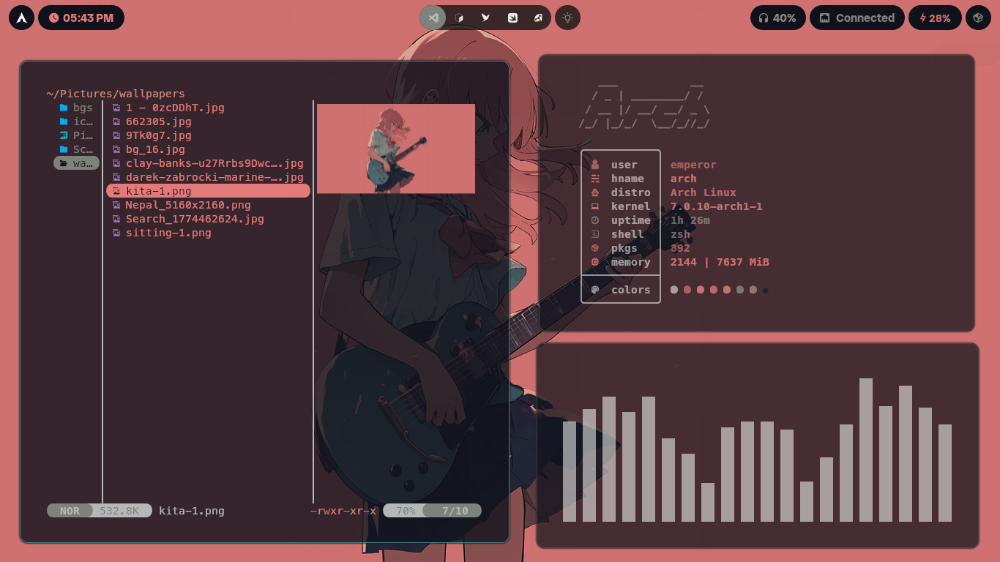
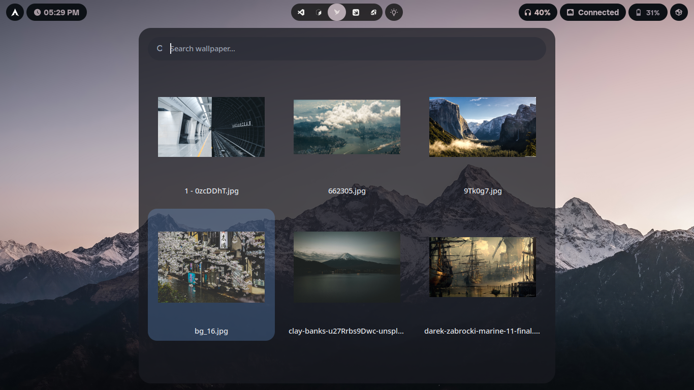
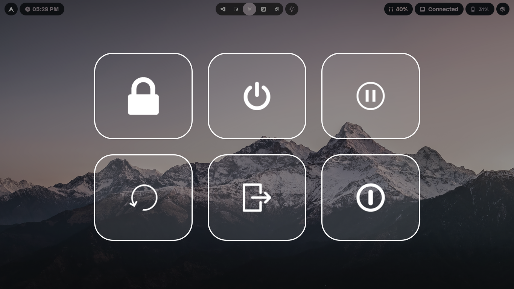

<div align="center">
  
</div>


<p align="center">
  <em>A modern Hyprland rice with dynamic wallpaper-based theming, Material You aesthetics, and a cohesive desktop experience</em>
</p>

<p align="center">
  
  
  
  
  
  
</p>

---

##  Preview

<p align="center">
  
</p>

---

## Overview

A comprehensive, modular dotfiles configuration for Arch Linux designed to provide a cohesive and productive desktop environment using Hyprland on Wayland. This setup prioritizes clarity, modularity, and ease of customization.

---

## Features

- **🎨 Dynamic Theming**: Wallpaper-driven color pipeline via pywal
- **⚡ High Performance**: Optimized Hyprland config with smooth animations
- **🎹 Comprehensive Keybindings**: Organized, discoverable shortcuts for all workflows
- **📊 Rich Status Bar**: Modular Waybar with customizable widgets and themes
- **🔍 App Launcher**: Pywal-themed Wofi with quick access
- **🎵 Audio Visualization**: Integrated Cava with custom styles
- **🔔 Native Notifications**: SwayNC with desktop integration
- **🖥️ Modern Terminal**: Kitty with Nerd Font support and custom colors
- **✨ Neovim Integration**: Lazy.nvim setup with LSP and plugins
- **🎯 Lock Screen**: Hyprlock with biometric and password support
- **📁 File Manager**: Thunar with custom theming
- **💾 Session Management**: Wlogout with custom menu styling

---


## Highlights

### Dynamic Color Pipeline

Your desktop's color scheme flows directly from your wallpaper. Using **pywal**, colors are extracted once and automatically propagate to Waybar, Wofi, Kitty, and other components through cached color files.

<table>
  <tr>
    <td width="50%"></td>
    <td width="50%"></td>
  </tr>
  <tr>
    <td width="50%"></td>
    <td width="50%"></td>
  </tr>
</table>

### Modular & Themeable

Swap themes, wallpapers, and layouts without touching multiple config files. The architecture is built with modularity in mind—everything from Waybar modules to Rofi menus can be customized independently.

### Integrated Applications

Every application respects your color scheme:

- **Waybar** draws from pywal colors
- **Kitty** terminal syncs with the palette
- **Wofi** launcher inherits the theme
- **SwayNC** notifications match the aesthetic
- **Cava** visualizer integrates seamlessly

---


## Gallery

### Desktop in Action

<table>
  <tr>
    <td width="50%" align="center">
      
      <br><sub>Wallpaper launcher with dynamic theming</sub>
    </td>
    <td width="50%" align="center">
      
      <br><sub>Session management menu</sub>
    </td>
  </tr>
</table>

---

## Component Overview

| Component     | Purpose                                       | Config Location           |
| ------------- | --------------------------------------------- | ------------------------- |
| **Hyprland**  | Wayland compositor with animations and tiling | `.config/hypr/`           |
| **Waybar**    | Status bar with modular widgets               | `.config/waybar/`         |
| **Kitty**     | GPU-accelerated terminal                      | `.config/kitty/`          |
| **Wofi**      | Application launcher                          | `.config/wofi/`           |
| **Neovim**    | Modal editor with LSP                         | `.config/nvim/`           |
| **Rofi**      | Menu system and scripts                       | `.config/rofi/`           |
| **SwayNC**    | Desktop notifications                         | SwayNC system integration |
| **Hyprlock**  | Lock screen                                   | `hyprlock.conf`           |
| **Thunar**    | File manager                                  | Thunar system integration |
| **pywal**     | Color extraction and theming                  | `~/.cache/wal/`           |

---

## Essential Keybindings

`$mainMod` = **Super (Windows key)**

### Applications

| Keybind          | Action                               |
| ---------------- | ------------------------------------ |
| `Super + Return` | Open Kitty terminal                  |
| `Super + D`      | Open Wofi launcher                   |
| `Super + E`      | Open Thunar file manager             |
| `Super + L`      | Switch wallpaper & regenerate colors |

### Window Management

| Keybind           | Action                     |
| ----------------- | -------------------------- |
| `Super + W`       | Close active window        |
| `Super + V`       | Toggle floating mode       |
| `Super + F`       | Toggle fullscreen          |
| `Super + ←/→/↑/↓` | Move focus between windows |

---


## Quick Start

1. **Clone the repository**:

   ```bash
   git clone https://github.com/Empeeror18/EmperialX
   cd EmperialX
   ```

2. **Review installation guide**:

   ```bash
   cat docs/INSTALLATION.md
   ```


For detailed installation instructions, see [docs/INSTALLATION.md](docs/INSTALLATION.md).

---

## Customization

### Change Your Color Scheme

Every color in the desktop is derived from your wallpaper:

```bash
wal -i ~/Pictures/my-wallpaper.jpg
```

Waybar, Kitty, and other components will automatically update.

### Reload Waybar

After editing Waybar config:

```bash
Super + R  # or manually:
~/.config/waybar/scripts/launch.sh
```

### Modify Keybindings

All bindings are centralized in `.config/hypr/binds.conf`. Edit this file to customize.

### Add Waybar Modules

Create new modules in `.config/waybar/modules/` and reference them in `config.jsonc`.

---

## Notes

- **Personal Setup**: These dotfiles are highly customized for my workflow and hardware. Adjustments may be necessary for your system.
- **Arch Linux Only**: Designed specifically for Arch Linux with `yay` or similar AUR helper.
- **Wayland-Only**: This setup uses Wayland exclusively. X11 is not supported.
- **Hardcoded Paths**: Some config files contain hardcoded `/home/emperor` paths. Replace with your username if needed.
- **Single Monitor**: Optimized for single-monitor setups. Multi-monitor configurations may require adjustments.

---

## Acknowledgments

Inspired by the vibrant Linux ricing community and the Arch Linux community. Built with love for open-source aesthetics and minimalist design.

---

<p align="center">
  <sub>Made by <a href="https://github.com/Empeeror18">Samrat Aryal (Empeeror18)</a></sub>
</p>
